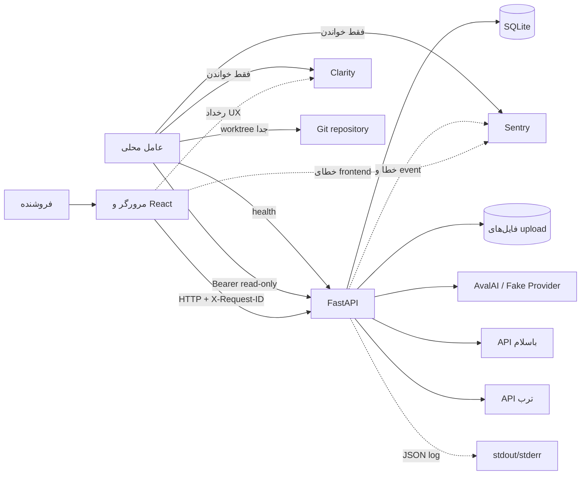
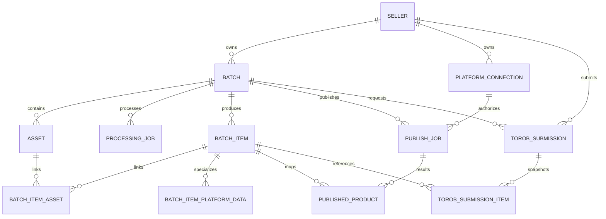
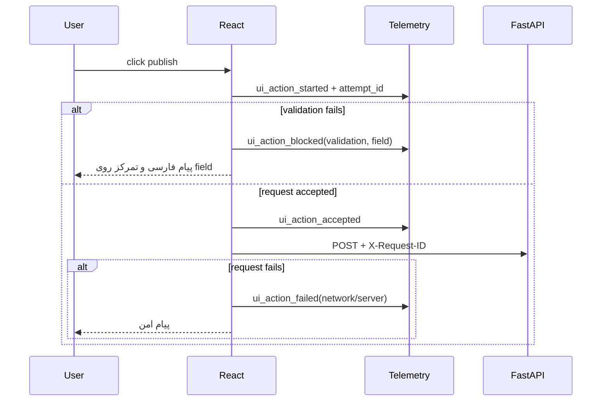
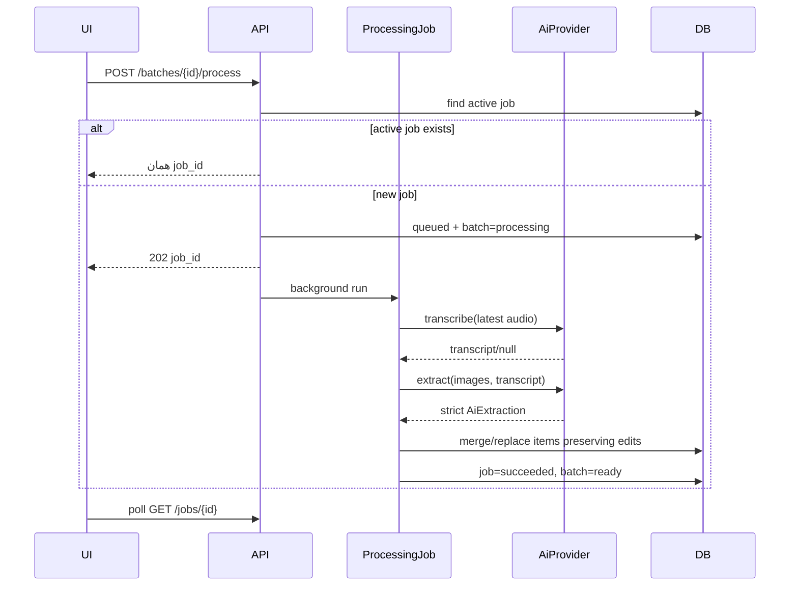
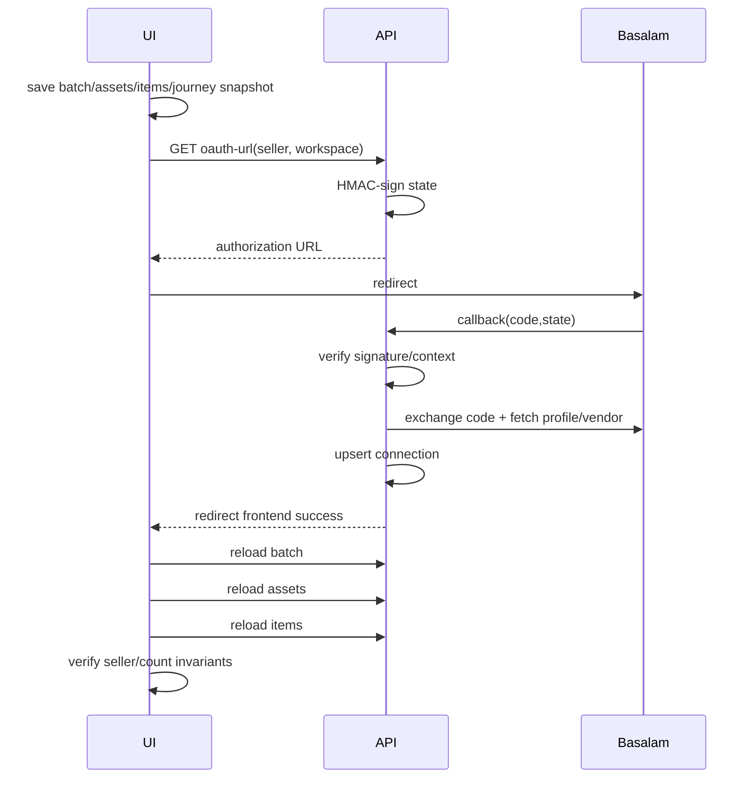
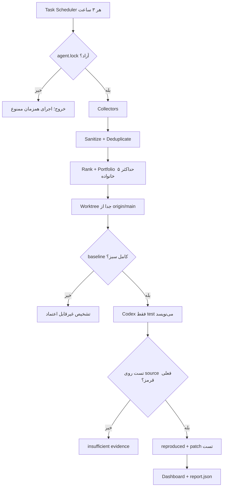
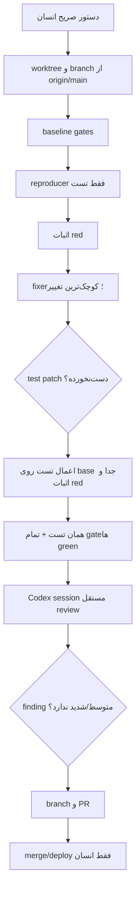

# راهنمای جامع مهندسی و طراحی BulkAddWithAI

این سند مرجع واحد برای فهم محصول، کد، داده، جریان‌های کسب‌وکار، هوش مصنوعی، انتشار، مشاهده‌پذیری و عامل نگه‌داری خودکار است. هرجا میان «چیزی که مطلوب است» و «چیزی که اکنون در کد وجود دارد» تفاوت باشد، وضعیت فعلی صریح نوشته شده است.

## ۱. مدل ذهنی محصول

BulkAddWithAI به فروشنده کمک می‌کند از چند عکس و یک توضیح صوتی، فهرست قابل‌ویرایش محصول بسازد و آن را به یکی از دو مسیر ببرد:

- **باسلام:** اتصال غرفه با OAuth، تکمیل اطلاعات تخصصی، انتخاب دسته و ثبت مستقیم محصول.
- **ترب:** ساخت درخواست، بررسی انسانی در پنل ادمین و سپس ارسال گروهی محصول‌های متناظر.

واحد اصلی کار یک `Batch` یا «نوبت ساخت کاتالوگ» است. عکس، صدا، خروجی AI، ویرایش‌ها و عملیات انتشار همگی باید به همان batch متصل بمانند.



### واژه‌های پایه

| واژه | معنای دقیق در این محصول |
|---|---|
| Seller | رکورد فروشنده‌ای که batchها و اتصال پلتفرم به او تعلق دارند. در نسخه فعلی معادل حساب احراز هویت‌شده واقعی نیست. |
| Workspace | شناسه تصادفی ذخیره‌شده در مرورگر برای جدا نگه‌داشتن فضای همان مرورگر؛ یک مرز امنیتی کامل سمت سرور نیست. |
| Batch | ظرف یک نوبت ورود عکس/صدا، پردازش AI و ساخت محصول. |
| Asset | فایل ورودی از نوع عکس یا صدا و metadata آن. |
| BatchItem | محصول قابل‌ویرایش ساخته‌شده از یک یا چند عکس. |
| Job | اجرای غیرهمزمان پردازش AI یا انتشار. |
| Platform connection | اتصال OAuth فروشنده به غرفه باسلام. |
| Signal | مشاهده خام و غیرحساس از log، Sentry، Clarity، health یا Black Box. |
| Candidate | سیگنال یا گروه سیگنال‌هایی که ارزش بازسازی دارند. |
| Regression test | تستی که رفتار مورد انتظار را بیان می‌کند و روی نسخه معیوب قرمز می‌شود. |
| Journey | سناریوی چندمرحله‌ای کاربر مانند اتصال غرفه و بازگردانی draft. |
| Invariant | قانونی که تحت هیچ مسیر موفق یا ناموفق نباید نقض شود. |

## ۲. مرز دامنه و قوانین تغییرناپذیر

قوانین زیر صرفاً پیشنهاد طراحی نیستند؛ معیار صحت محصول‌اند:

1. داده، batch، عکس، job و انتشار باسلام و ترب نباید با هم مخلوط شوند.
2. غرفه یک فروشنده نباید به فروشنده یا workspace دیگری متصل شود.
3. شکست AI یا پلتفرم نباید upload و draft کاربر را حذف کند.
4. خطای کاربر باید فارسی و قابل اقدام باشد؛ متن خام provider نباید نمایش داده شود.
5. token، OAuth code/state، موبایل، متن ویس، تصویر، query string و payload کامل محصول نباید log شوند.
6. AI اجازه ندارد ویرایش آگاهانه کاربر را در پردازش مجدد نابود کند.
7. عملیات بیرونی باید تا حد ممکن idempotent باشد یا از تکرار ناخواسته جلوگیری کند.

مثال نقض invariant: کاربر عنوان را دستی به «کیف چرمی قهوه‌ای» تغییر می‌دهد و سپس برای تکمیل وزن دوباره ویس می‌فرستد. اگر پردازش دوم عنوان را به خروجی جدید AI برگرداند، سیستم از نظر فنی پاسخ ۲۰۰ داده اما از نظر محصول خراب است.

## ۳. ساختار repository و مسئولیت هر بخش

```text
BulkAddWithAi/
├── backend/
│   ├── app/
│   │   ├── main.py                 composition root و endpointها
│   │   ├── models.py               مدل‌های SQLAlchemy
│   │   ├── schemas.py              قراردادهای ورودی/خروجی Pydantic
│   │   ├── services.py             upload، پردازش AI و ویرایش item
│   │   ├── platform_services.py    OAuth، دسته و publish باسلام
│   │   ├── torob_services.py       گردش درخواست و انتشار ترب
│   │   ├── ai.py                   interface و providerهای AI
│   │   ├── observability.py        log، Sentry، redaction و event store
│   │   ├── database.py             engine، session و SQLite
│   │   ├── config.py               تنظیمات environment
│   │   └── integrations/           clientهای HTTP باسلام و ترب
│   └── tests/                      تست‌های unit/integration backend
├── frontend/
│   ├── src/App.tsx                 state و UI اصلی و پنل ادمین
│   ├── src/lib/api.ts              client HTTP و ترجمه خطا
│   ├── src/lib/telemetry.ts        Sentry، Clarity و کنترل‌های observed
│   ├── src/types.ts                قرارداد TypeScript
│   └── tests/                      Playwright E2E
├── automation/
│   ├── runner.py                   orchestrator عامل
│   ├── collectors.py               جمع‌آوری منابع evidence
│   ├── analyzers.py                تحلیل deterministic
│   ├── journey_contracts.json      قرارداد پوشش journeyها
│   ├── dashboard.py                گزارش HTML فارسی
│   ├── security.py                 guardrail تغییر و پاک‌سازی داده
│   ├── state.py                    state، retention و exclusive lock
│   ├── policy.json                 سقف‌ها، مسیرهای ممنوع و test gateها
│   └── prompts/                    قرارداد reproducer/fixer/reviewer
├── docs/                           قراردادهای مهندسی و release
├── Dockerfile                      image واحد frontend + backend
└── .github/workflows/              test، build و push image؛ نه deploy
```

اصل لایه‌بندی: endpoint باید orchestration نازک باشد؛ validation شکلی در schema، منطق دامنه در service، I/O پلتفرم در integration client و persistence در مدل/session قرار می‌گیرد.

## ۴. توپولوژی runtime و deployment

Dockerfile دو مرحله دارد:

1. Node 20 فایل‌های React/Vite را build می‌کند.
2. Python 3.12 backend، dependencyها و خروجی frontend را در یک image قرار می‌دهد.

Uvicorn روی پورت ۸۰۰۰ هم API و هم فایل‌های buildشده frontend را سرو می‌کند. تنظیم پیش‌فرض production:

```env
DATABASE_URL=sqlite:////data/catalog.db
UPLOAD_DIR=/data/uploads
FRONTEND_DIST_DIR=/app/frontend-dist
```

```mermaid
flowchart TB
    GH[push به GitHub] --> CI[tests + build]
    CI --> GHCR[image در GHCR با tag مربوط به commit]
    H[انسان] -->|انتخاب image tag| D[Darkube/Hamravesh]
    GHCR --> D
    D --> C[Container]
    C --> UV[Uvicorn :8000]
    C --> DATA[/data]
```

GitHub workflow deploy نمی‌کند. merge باعث build image جدید می‌شود؛ اعمال tag جدید در سرویس production یک تصمیم انسانی جدا است.

### واقعیت persistence فعلی

SQLite و فایل‌ها روی `/data` هستند. اگر این مسیر volume پایدار نداشته باشد، restart یا جایگزینی container می‌تواند database، uploadها و operational eventها را حذف کند. «کاربر کارش راه می‌افتد» تا وقتی همان container زنده است، اما تضمین ماندگاری وجود ندارد. این یک محدودیت عملیاتی مهم است، نه جزئیات کم‌اهمیت.

### تنظیمات runtime و مالک هر secret

`Settings` با `pydantic-settings` مقدارها را از environment و در توسعه از `.env` می‌خواند. مقدارهای مهم:

| متغیر | مصرف‌کننده | secret؟ | رفتار در نبود آن |
|---|---|---:|---|
| `AI_PROVIDER` | backend | خیر | `auto`؛ اگر کلید AvalAI باشد واقعی، وگرنه fake |
| `AVALAI_API_KEY` | backend | بله | provider واقعی در دسترس نیست |
| `AVALAI_BASE_URL` | backend | خیر | پیش‌فرض API AvalAI |
| `AVALAI_*_MODEL` | backend | خیر | مدل‌های پیش‌فرض کد استفاده می‌شوند |
| `DATABASE_URL` | backend | ممکن است | SQLite محلی پیش‌فرض |
| `UPLOAD_DIR` | backend | خیر | `./data/uploads` |
| `APP_ENVIRONMENT`, `APP_RELEASE` | log/Sentry | خیر | development و release نامشخص |
| `SENTRY_DSN` | backend | DSN عمومی ingest | backend event نمی‌فرستد |
| `VITE_SENTRY_DSN` | frontend در زمان build | DSN عمومی ingest | frontend Sentry خاموش است |
| `OBSERVABILITY_READ_TOKEN` | backend | بله | feed عامل قابل خواندن نیست |
| `BASALAM_CLIENT_ID/SECRET` | backend | secret فقط برای secret | OAuth configured=false می‌شود |
| `BASALAM_REDIRECT_URI` | backend | خیر | OAuth قابل شروع نیست |
| `ADMIN_PASSWORD` | backend | بله | پنل admin عملیاتی نیست |
| `TOROB_BULK_ADD_KEY` و auth value | backend | بله | publish ترب ممکن نیست |

متغیرهای `VITE_*` هنگام **build image** داخل bundle frontend تثبیت می‌شوند؛ تغییر environment runtime container آن bundle قبلی را عوض نمی‌کند. در مقابل متغیرهای backend در start container خوانده می‌شوند.

## ۵. مدل داده

### نمودار رابطه‌ها



### Seller

فیلدهای اصلی: `id`, `name`, `mobile`, `shop_name`, `created_at`, `updated_at`.

Seller ریشه ownership است، اما در نسخه فعلی login واقعی و session server-side نداریم. frontend یک seller را برای همان مرورگر می‌سازد یا از localStorage بازیابی می‌کند. بنابراین دانستن `seller_id` به‌تنهایی نباید در معماری نهایی مجوز دسترسی تلقی شود.

### Batch

فیلدها: `seller_id`, `status`, `raw_transcript`, `ai_metadata` و زمان‌ها.

چرخه معمول:

```text
created → upload_ready → processing → ready
                              └──────→ failed
```

- `raw_transcript` متن کامل ویس است و داده حساس محسوب می‌شود؛ در log و telemetry ممنوع است.
- `ai_metadata` برای metadata provider و failure امن مانند stage، code، attempts و exception type استفاده می‌شود.
- حذف batch به‌واسطه relationshipها item و assetهای وابسته را orphan-delete می‌کند، ولی حذف فایل فیزیکی نیازمند منطق service است.

### Asset

Asset نماینده فایل است، نه خود بایت‌های فایل در DB:

- `type`: `image` یا `audio`
- `upload_order`: ترتیب پایدار برای اتصال خروجی AI به عکس
- `file_path`: مسیر داخلی server
- `original_filename`, `mime_type`, `size_bytes`, `checksum`

`checksum` با SHA-256 محاسبه می‌شود. عکس ورودی normalize و به JPEG تبدیل می‌شود. فایل موقت ابتدا نوشته می‌شود تا ورودی ناقص مستقیم جای فایل نهایی ننشیند.

### ProcessingJob

یک اجرای پردازش AI است: `queued/running/succeeded/failed` و stepهایی مانند `transcribing` و `extracting`. خطای عمومی آن باید پیام امن باشد؛ جزئیات فنی در log و metadata کنترل‌شده می‌ماند.

وجود job فعال برای همان batch باعث می‌شود درخواست تکراری process همان job را برگرداند. این دفاع در برابر double-click است.

### BatchItem

هسته محصول پیشنهادی:

- محتوایی: `title`, `description`
- تجاری: `price_toman`, `stock`
- fulfillment: `preparation_days`
- حمل: `weight_grams`, `package_weight_grams`
- واحد فروش: `unit_quantity`
- AI: `confidence`
- مالکیت ویرایش: `edited_by_user`

`edited_by_user` فقط یک flag ساده است و granularity آن در سطح کل item است، نه هر field. frontend جداگانه touched-fieldها را نگه می‌دارد تا draft دقیق‌تر merge شود.

### BatchItemAsset

رابط many-to-many میان محصول و عکس است. `role` و `sort_order` اجازه می‌دهند چند عکس یک محصول و ترتیب دلخواه داشته باشند. merge و split در اصل همین joinها را جابه‌جا می‌کنند.

### BatchItemPlatformData

اطلاعات وابسته به پلتفرم از core item جداست. unique key روی `(batch_item_id, platform)` می‌گوید هر محصول برای هر پلتفرم یک snapshot تخصصی دارد. برای باسلام شامل category id/path/title، confidence/source، unit type و maximum preparation days است.

این جداسازی مهم است: دسته باسلام نباید به محصول ترب نشت کند و تغییر مسیر پلتفرم نباید core product را خراب کند.

### PlatformConnection

اتصال OAuth شامل external user/shop، tokenها، scope، expiry و metadata است. `workspace_id` در metadata نگهداری می‌شود. tokenها در DB لازم‌اند ولی هرگز نباید در response عمومی، log یا Sentry ظاهر شوند.

قید unique روی `(platform, external_shop_id)` مانع ثبت چندباره یک غرفه می‌شود. service هنگام callback باید seller و workspace امضاشده در state را بررسی کند.

### PublishJob و PublishedProduct

`PublishJob` وضعیت کل batch را نگه می‌دارد؛ `PublishedProduct` نتیجه هر item را. این تفکیک برای partial failure لازم است: ممکن است دو محصول ثبت شوند و سومی fail شود. حذف نتایج موفق برای یک شکست، رفتار غلط است.

### TorobSubmission و TorobSubmissionItem

Submission یک درخواست snapshotشده از seller/batch و اطلاعات تماس است. هر item مقدار `base_product_rk` و price قابل بررسی دارد. snapshot باعث می‌شود تغییر بعدی item اصلی، تصمیم ادمین در submission جاری را بدون کنترل تغییر ندهد.

### OperationalEvent

این جدول database کسب‌وکار نیست؛ event store کوچک، allowlistشده و PII-free برای عامل است. فیلدهای آن event، severity، environment، release، request/job/batch id، stage، code، context محدود و timestamp هستند. retention عادی ۳۰ روز است.

### قیدهایی که در DB هستند و قیدهایی که فقط در service هستند

این تفاوت برای تحلیل race condition حیاتی است:

| قانون | محل enforce فعلی |
|---|---|
| هر category snapshot برای هر item/platform یکتا باشد | `UniqueConstraint` در DB |
| هر external shop در هر platform یکتا باشد | `UniqueConstraint` در DB |
| itemهای merge همگی متعلق به یک batch باشند | service |
| asset هنگام split متعلق به همان item باشد | service |
| connection متعلق به seller/workspace درست باشد | service و OAuth state |
| فقط یک job فعال پردازش/انتشار وجود داشته باشد | query در service؛ unique DB ندارد |
| upload order در batch یکتا باشد | service؛ unique DB ندارد |
| itemهای Torob publish متعلق به submission باشند | service |

قوانینی که فقط با «اول query، بعد insert» enforce می‌شوند ممکن است زیر concurrency واقعی race داشته باشند. برای multi-replica باید constraint یا lock در DB نیز اضافه شود.

### جدول کامل stateهای عملیاتی

| aggregate | statusها | stepها/معنا |
|---|---|---|
| Batch | `draft`, `upload_ready`, `processing`, `ready`, `failed` | وضعیت آمادگی catalog، نه publish |
| ProcessingJob | `queued`, `running`, `succeeded`, `failed` | `upload_ready → transcribing → vision_extracting → matching → ready/failed` |
| PlatformConnection | `connected` | اتصال قابل استفاده؛ refresh token ممکن است nullable باشد |
| PublishJob | `queued`, `running`, `succeeded`, `partial_failed`, `failed` | `uploading_photos → creating_products → ready/failed` |
| PublishedProduct | `pending`, `published`, `failed` | نتیجه یک item در یک job |
| TorobSubmission | `pending`, `submitting`, `submitted`, `failed` | گردش بررسی/ارسال کل درخواست |
| TorobSubmissionItem | `pending`, `submitted`, `failed` | نتیجه item داخل submission |

statusها در ستون string ذخیره می‌شوند و enum/database check ندارند. مزیت آن iteration سریع MVP و عیب آن امکان typo یا state نامعتبر است. تست transition و refactor آینده به enum یا state machine صریح مناسب است.

## ۶. قرارداد HTTP و API

FastAPI ورودی را با Pydantic validate می‌کند. خطای شکل request معمولاً 422، نبود resource معمولاً 404، شروع job غیرهمزمان 202 و ساخت resource 201 است.

هر request frontend یک `X-Request-ID` پایدار در session مرورگر دارد. middleware مقدار امن را قبول می‌کند یا مقدار جدید می‌سازد، آن را در response برمی‌گرداند و در log همان request استفاده می‌کند. query string عمداً log نمی‌شود چون callback OAuth حاوی secret موقت است.

### گروه endpointها

| حوزه | endpointهای اصلی | کار |
|---|---|---|
| سلامت | `GET /health` | liveness ساده |
| فروشنده | `/sellers` | ساخت، فهرست، خواندن و ویرایش |
| batch | `/batches` | ساخت و بازیابی نوبت |
| asset | `/batches/{id}/assets`, `/assets/{id}` | upload/list/delete |
| AI | `POST /batches/{id}/process`, `GET /jobs/{id}` | شروع و polling پردازش |
| item | `/batches/{id}/items`, `/batch-items/...` | patch، merge، split و reorder |
| باسلام | `/integrations/basalam/...` | OAuth، category و callback |
| publish | `/batches/{id}/publish/basalam`, `/publish-jobs/{id}` | انتشار و polling |
| ترب | `/batches/{id}/torob-submissions`, `/admin/torob-submissions/...` | درخواست، بررسی و publish |
| مشاهده‌پذیری | `/observability/...` | ingest امن و feed فقط‌خواندنی |
| export | `/batches/{id}/export.json|csv` | خروجی کاربر؛ نه منبع telemetry |

Background task در FastAPI job را پس از پاسخ 202 اجرا می‌کند. این queue durable نیست: restart process می‌تواند job درحال اجرا را قطع کند. برای scale production باید queue واقعی، lease و retry durable طراحی شود.

## ۷. معماری frontend

Frontend با React، TypeScript و Vite ساخته شده است. `App.tsx` اکنون component بسیار بزرگی است و هم state machine اصلی، هم UI و هم پنل ادمین را در خود دارد. این کار برای MVP سریع بوده ولی coupling و هزینه تغییر را بالا می‌برد.

### stateهای مهم

- platform انتخابی: `basalam | torob | null`
- seller و workspace مرورگر
- batch، assets، items و job پردازش
- draftهای قابل‌ویرایش و touched fields
- connection، OAuth restore و publish job
- اطلاعات submission ترب و state پنل ادمین

### localStorage و sessionStorage

| کلید | کاربرد | نکته |
|---|---|---|
| `bulkadd_seller_id` | seller همان مرورگر | authentication نیست |
| `bulkadd_workspace_id` | جداسازی workspace | UUID محلی |
| `bulkadd_basalam_active_batch_id` | بازگشت به batch پس از OAuth | مانع گم‌شدن کار |
| `bulkadd_basalam_oauth_snapshot` | batch id، تعداد asset/item و journey id | برای invariant restore |
| `bulkadd_product_drafts...` | draft و touched fields به تفکیک platform/batch | حفظ تایپ‌های ذخیره‌نشده |
| `bulkadd_request_id` در sessionStorage | correlation requestها | با بستن session تغییر می‌کند |

localStorage پایدارتر از state حافظه React است، اما database نیست: کاربر می‌تواند آن را پاک کند، مرورگر دیگری آن را ندارد و داده آن قابل اعتماد امنیتی نیست.

### چرخه یک action مشاهده‌شده



Observer عمومی روی elementهای `data-observe-control` سه کلیک در ۱.۵ ثانیه را rage click می‌داند. اگر action غیر-upload پس از pointer-up در ۱.۵ ثانیه توسط handler مصرف نشود، dead click ثبت می‌شود. این event نام control را دارد؛ بنابراین برخلاف metric کلی Clarity می‌توان فهمید مشکل روی کدام کنترل بوده است.

## ۸. جریان upload و مدیریت asset

### frontend

1. کاربر picker یا drop zone را فعال می‌کند.
2. lifecycle picker با `attempt_id` ثبت می‌شود: opened، selected یا cancelled.
3. آماده‌سازی فایل با concurrency برابر ۲ انجام می‌شود تا حافظه مرورگر با ده‌ها عکس همزمان اشباع نشود.
4. عکس بزرگ resize/normalize و سپس FormData ارسال می‌شود.
5. پاسخ assetها state UI را به‌روزرسانی می‌کند.

### backend

1. وجود batch و MIME/suffix مجاز بررسی می‌شود.
2. فایل موقت نوشته می‌شود.
3. تصویر decode و JPEG استاندارد تولید می‌شود؛ audio با format واقعی نگه داشته می‌شود.
4. checksum و size محاسبه می‌شود.
5. فایل در `<upload_dir>/<batch>/<type>/` قرار می‌گیرد.
6. رکورد Asset ساخته و batch به `upload_ready` می‌رود.

برای upload چند فایل، DB transaction و حذف جبرانی فایل استفاده می‌شود. این atomic transaction واقعی میان filesystem و SQLite نیست. اگر process در نقطه نامناسب crash کند ممکن است orphan file بماند؛ reconciliation job آینده باید فایل‌های بدون رکورد و رکوردهای بدون فایل را پیدا کند.

حذف asset وقتی به item وصل است ممنوع است. پس از حذف، upload_orderها دوباره متوالی می‌شوند و حذف فایل فیزیکی best effort است.

## ۹. جریان پردازش AI



### provider interface

`AiProvider` سه capability دارد:

- `transcribe(audio)`
- `extract_products(images, transcript)`
- `choose_basalam_category(...)` یا نسخه batch آن

`FakeAiProvider` deterministic است و برای تست بدون هزینه و flakiness استفاده می‌شود. `AvalAiProvider` از API سازگار با OpenAI در `https://api.avalai.ir/v1` استفاده می‌کند. تنظیم فعلی مدل‌ها:

```text
vision/text: gpt-5.4
speech-to-text: gpt-4o-mini-transcribe
service provider: AvalAI
```

مدل AI با schema سخت JSON محدود می‌شود: فیلد اضافه ممنوع، confidence بین صفر و یک و `image_numbers` اجباری است. سپس همان خروجی دوباره با Pydantic validate می‌شود. این دو لایه احتمال خروجی آزاد و خراب را کم می‌کنند، ولی صحت معنایی را تضمین نمی‌کنند.

AI اجازه حدس stock، وزن و زمان آماده‌سازی را ندارد؛ فقط اگر صریحاً در ویس آمده باشد پر می‌کند. price به تومان normalize می‌شود و parser backend نیز الگوهای عدد فارسی/عربی و عبارت‌های رایج را بررسی می‌کند.

### retry

timeout، network error، HTTP 408/409/429/5xx، JSON نامعتبر و خروجی خالی موقت تلقی می‌شوند. حداکثر سه attempt با delayهای کنترل‌شده انجام می‌شود. عکس/صوت نامعتبر و خطاهای قطعی بی‌دلیل retry نمی‌شوند.

### حفظ ویرایش کاربر

محصول‌های قدیم و جدید بر اساس مجموعه assetها match می‌شوند:

- item ویرایش‌نشده می‌تواند با خروجی AI refresh شود.
- item ویرایش‌شده عنوان/توضیح/قیمت موجود خود را حفظ می‌کند و AI فقط خانه خالی را پر می‌کند.
- فیلدهای عددی فقط در صورت خالی‌بودن یا ویرایش‌نشده‌بودن item update می‌شوند.
- عکس استفاده‌نشده به fallback item مستقل تبدیل می‌شود تا هیچ ورودی گم نشود.

## ۱۰. ویرایش، merge، split و reorder

`PATCH /batch-items/{id}` فقط fieldهای ارسال‌شده را تغییر و `edited_by_user=true` می‌کند. frontend draft را پیش از response و پس از آن با touched map merge می‌کند.

- **merge:** همه itemها باید در یک batch باشند. item اول primary است؛ assetها بدون تکرار به آن منتقل و بقیه حذف می‌شوند.
- **split:** assetهای انتخابی باید subset همان item باشند و انتخاب همه assetها مجاز نیست؛ یک item جدید ساخته می‌شود.
- **reorder:** request باید دقیقاً همان مجموعه assetهای فعلی را داشته باشد؛ فقط ترتیب عوض می‌شود.

این preconditionها جلوی attach کردن asset بیگانه یا گم‌شدن عکس بر اثر payload ناقص را می‌گیرند.

## ۱۱. اتصال باسلام و بازگردانی کار

OAuth یک redirect چندمرحله‌ای است؛ state حافظه React از بین می‌رود. به همین دلیل snapshot محلی و state امضاشده سرور هر دو لازم‌اند.



Black Box این journey را در پنج stage پوشش می‌دهد: `oauth_redirect`, `batch_restored`, `assets_restored`, `items_restored`, `restore_complete`. تعداد قبل و بعد، seller mismatch و request failure با داده غیرشخصی ثبت می‌شود.

تفاوت دو شناسه:

- OAuth `state`: داده امضاشده برای جلوگیری از جعل callback و اتصال اشتباه.
- `journey_id`: UUID تصادفی برای وصل‌کردن stepهای یک تجربه؛ مجوز امنیتی نیست.

## ۱۲. انتخاب دسته و انتشار باسلام

### category

دسته‌های واقعی از باسلام fetch و cache می‌شوند. برای هر محصول shortlist ساخته می‌شود و AI فقط حق انتخاب یکی از candidate idها را دارد؛ ساخت category خیالی ممنوع است. انتخاب دستی با `source=user` و confidence برابر ۱ ثبت می‌شود.

اگر confidence پیشنهاد خودکار زیر threshold باشد، UI از کاربر انتخاب می‌خواهد. اگر باسلام category خودکار را هنگام create رد کند، service candidateهای بعدی همان shortlist را امتحان می‌کند؛ انتخاب دستی کاربر بدون اجازه جایگزین نمی‌شود.

### validation قبل از side effect

پیش از upload عکس یا create محصول، همه itemها از نظر قیمت، موجودی، روز آماده‌سازی، وزن محصول، وزن بسته، تعداد واحد، category و داشتن عکس validate می‌شوند. قاعده بسته نیز مانع وزن بسته غیرمنطقی بیش از سه برابر وزن محصول در وزن‌های بالاتر می‌شود.

این ترتیب مهم است: اگر item سوم ناقص باشد، نباید ابتدا دو عکس و دو محصول بیرونی ایجاد و سپس متوقف شویم.

### publish

1. connection باید connected و متعلق به seller/workspace batch باشد.
2. job فعال تکراری برگردانده می‌شود.
3. validation کل batch اجرا می‌شود.
4. تصاویر batch یک‌بار upload می‌شوند.
5. برای هر item payload ساخته می‌شود؛ تومان در مرز API به ریال `×10` تبدیل می‌شود.
6. هر نتیجه مستقل در PublishedProduct ثبت می‌شود.
7. 401 یک‌بار refresh token و retry می‌شود.
8. status نهایی `succeeded`, `partial_failed` یا `failed` است.

خطای provider ممکن است برای تشخیص داخلی نگهداری شود، اما UI فقط ترجمه فارسی امن را می‌بیند.

## ۱۳. مسیر ترب

مسیر فعلی دو actor دارد:

1. فروشنده batch را آماده و با shop name و mobile یک submission می‌سازد.
2. ادمین در `/admin` با password، shop id و `base_product_rk` هر item را بررسی و حداکثر ۱۰۰ item را publish می‌کند.

درخواست فعال pending/submitting برای همان context دوباره ساخته نمی‌شود. هنگام publish، itemها باید متعلق به همان submission باشند. شکست provider submission و itemها را به failed می‌برد و پیام خام بیرونی به کاربر داده نمی‌شود.

تطبیق هوشمند واقعی محصول ترب هنوز کامل نیست؛ ورود دستی `base_product_rk` fallback فعلی است. نباید UI موجود را با موتور matching production اشتباه گرفت.

## ۱۴. transaction، concurrency و idempotency

سه مفهوم متفاوت‌اند:

- **Transaction:** چند تغییر DB یا همه commit می‌شوند یا rollback.
- **Idempotency:** تکرار یک فرمان اثر بیرونی تکراری ایجاد نکند.
- **Concurrency control:** دو actor همزمان invariant را نشکنند.

نمونه‌های فعلی:

- upload گروهی rollback DB و cleanup جبرانی فایل دارد.
- process و publish job فعال را reuse می‌کنند.
- frontend برای بعضی requestهای platform از sequence id استفاده می‌کند تا response قدیمی state جدید را overwrite نکند.
- SQLite و BackgroundTasks برای بار کم مناسب‌اند ولی lock توزیع‌شده، queue durable و exactly-once ندارند.

برای scale چند replica باید PostgreSQL، unique idempotency key، row locking یا optimistic version، object storage و queue worker اضافه شود.

## ۱۵. خطا و تجربه کاربر

خطا سه نمایش دارد:

| سطح | محتوا | مخاطب |
|---|---|---|
| UI | فارسی، کوتاه و دارای اقدام بعدی | فروشنده |
| domain/job | code و stage امن | API و dashboard |
| diagnostic | exception type، stack trace و provider status پاک‌سازی‌شده | توسعه‌دهنده/Sentry |

`api.ts` خطاهای شناخته‌شده مانند batch/asset/item not found را ترجمه می‌کند. اگر detail فارسی امن باشد می‌تواند نمایش داده شود؛ JSON یا متن انگلیسی ناشناخته به پیام عمومی تبدیل می‌شود.

Failure mode مهم: صرفاً catch کردن exception و نمایش «خطا شد» مشاهده‌پذیری نیست. باید مشخص باشد کدام action، stage، release و outcome شکست خورده، بدون اینکه داده کاربر ثبت شود.

## ۱۶. امنیت و حریم خصوصی

### threat boundary فعلی

- DSN Sentry secret مدیریتی نیست، اما auth token خواندن Sentry secret است.
- token OAuth و client secret فقط server-side هستند.
- frontend localStorage قابل دستکاری است؛ شناسه‌های آن input غیرقابل اعتمادند.
- `X-Admin-Password` کنترل ساده MVP است و جای RBAC/session امن را نمی‌گیرد.
- endpoint observability فقط با bearer read token و response allowlistشده قابل خواندن است.

### داده‌های ممنوع در telemetry

token، secret، authorization/cookie، موبایل، نام، title/description، transcript، voice، تصویر، payload کامل، query string و request/session id خام.

Sentry frontend با `sendDefaultPii=false` راه‌اندازی می‌شود؛ user/cookie/body حذف، query URL strip و headerهای حساس پاک می‌شوند. traces فعلاً صفر است. backend نیز event processor و structured logging امن دارد.

### مسئله چندکاربره

Seller/workspace فعلی isolation کاربردی ایجاد می‌کند اما احراز هویت production-grade نیست. قبل از چندکاربره واقعی باید principal معتبر، authorization روی تمام resourceها و testهای IDOR اضافه شود.

## ۱۷. مشاهده‌پذیری: از metric تا Black Box

چهار لایه مکمل داریم:

1. **Structured log:** جزئیات عملیاتی backend روی stdout/stderr.
2. **Sentry:** exception و stack trace frontend/backend.
3. **Clarity:** replay انسانی و aggregateهای رفتاری؛ منبع ثانویه.
4. **Product Black Box:** state transitionهای allowlistشده خود محصول؛ منبع اصلی برای مکان و علت.

### چرا Clarity به‌تنهایی کافی نیست؟

Data Export عمدتاً aggregate می‌دهد. «۴۰ dead click» نمی‌گوید handler کدام button چه stateای داشته است. replay برای انسان مفید است اما عامل نباید ویدئوی واقعی کاربر را دانلود یا با حدس تفسیر کند. بنابراین خود محصول control و outcome را ثبت می‌کند و Clarity فقط شدت و فراوانی را تقویت می‌کند.

### Black Box دقیقاً چیست؟

Black Box یک ضبط ویدئویی یا dump state نیست. یک دفتر ثبت گذارهای حالت با schema بسته است:

```json
{
  "event": "journey_step",
  "journey": "basalam_connect_restore",
  "journey_id": "uuid-random",
  "stage": "assets_restored",
  "outcome": "progress",
  "expected_asset_count": 4,
  "actual_asset_count": 4,
  "duration_ms": 380
}
```

Backend هر field اضافه، journey ناشناخته، stage خارج از قرارداد یا failure بدون reason امن را با validation رد می‌کند. شناسه journey بعداً از signal عمومی حذف/هش می‌شود تا گزارش عامل session قابل ردیابی انسانی نداشته باشد.

یک journey contract تعریف می‌کند:

- چه stageهایی باید وجود داشته باشند؛
- ترتیب مورد انتظار چیست؛
- terminal success چیست؛
- چه invariantهایی در هر stage سنجیده می‌شوند؛
- چه eventهایی اثبات failure هستند.

اگر contract پنج stage بخواهد ولی instrumentation فقط دو stage داشته باشد، «نمی‌دانیم» به `journey_observability_gap` تبدیل می‌شود. این signal باید به اقدام مهندسی برای افزودن telemetry/test منجر شود، نه حدس درباره کاربر.

### پوشش فعلی journeyها

Schema شش journey را می‌شناسد: مدیریت asset، ساخت catalog، ویرایش محصول، اتصال/restore باسلام، publish باسلام و submit ترب. اما audit فعلی فقط journey اتصال/restore باسلام را ۵ از ۵ کامل می‌داند. پنج مورد دیگر gap دارند. تعریف stage در schema به معنای emit شدن واقعی همه stageها نیست.

### eventهای مهم backend

- فوری: `http_request_failed`, `upload_batch_failed`, `basalam_publish_failed`
- بالا: `processing_job_failed`, `basalam_product_failed`
- UX/validation: `image_upload_rejected`, `basalam_publish_validation_failed`
- integration: `basalam_oauth_failed`, `torob_publish_failed`

## ۱۸. عامل نگه‌داری خودکار

عامل یک برنامه جدا روی Windows است، نه بخشی از request path محصول. Task Scheduler هر سه ساعت آن را اجرا می‌کند. مسیر state و گزارش:

```text
%LOCALAPPDATA%\BulkAddWithAi-agent\
├── state.json
├── agent.lock
├── cache/
├── worktrees/
├── dashboard/index.html
└── runs/<UTC-run-id>/
```

run id مانند `20260714T234702Z` زمان UTC با قالب `YYYYMMDDTHHMMSSZ` است؛ dashboard آن را به وقت تهران و مدت اجرا ترجمه می‌کند.

### pipeline واقعی اجرای زمان‌بندی‌شده



Collectorها: local logs، product event feed، Sentry، cache/API Clarity، health، UX contract، journey contract و browser probe deterministic.

Signalها fingerprint می‌شوند تا رخداد تکراری یک مسئله دوباره‌کاری نشود. portfolio ابتدا failureهای first-party و control دقیق را انتخاب می‌کند و اجازه نمی‌دهد یک event family هر پنج slot را پر کند. aggregate خالص Clarity پایین‌تر رتبه می‌گیرد.

### وضعیت دقیق autonomy فعلی

اجرای scheduler اکنون فقط **تشخیص** انجام می‌دهد:

- می‌تواند candidate بسازد؛
- می‌تواند در worktree جدا baseline را اجرا کند؛
- می‌تواند فقط test file اضافه کند؛
- فقط اگر تست روی کد فعلی قرمز شد، status را `reproduced` می‌گذارد؛
- خودش product source، branch یا PR نمی‌سازد.

تابع `attempt_fix` پیاده‌سازی شده و در simulation/جریان صریح قابل استفاده است، اما `run_once` زمان‌بندی‌شده آن را فراخوانی نمی‌کند. این guardrail عمدی است: اصلاح نیازمند دستور صریح انسان است.

### pipeline اصلاحِ مجازشده



`policy.json` حداکثر ۸ فایل و ۵۰۰ خط تغییر را اجازه می‌دهد و workflow، policy/prompt/schema عامل، migration، model/config، integration، dependency، Docker و secretها را ممنوع کرده است.

### معنای exclusive lock و worktree

Lock یعنی دو **run کامل orchestrator** همزمان روی state/dashboard کار نکنند. worktree یعنی هر diagnosis یا fix checkout مستقل دارد و main checkout کاربر لمس نمی‌شود. از نظر فنی می‌توان چند worktree را parallel اجرا کرد، اما implementation فعلی diagnosisها را sequential اجرا می‌کند تا CPU/RAM، lock فایل‌های تست و نرخ API کنترل شود.

### retention و kill switch

- ایجاد فایل `PAUSED` در state root عامل را متوقف می‌کند.
- timeout policy سه ساعت است.
- گزارش عادی پس از ۳۰ روز حذف می‌شود.
- evidence مربوط به PR باز، rollback، failure یا diagnosis بازسازی‌شده محافظت می‌شود.
- state با write موقت و replace ذخیره می‌شود تا فایل نیمه‌نوشته کمتر ایجاد شود.

## ۱۹. داشبورد و خواندن یک گزارش

هر کارت باید پاسخ پنج سؤال را بدهد:

1. چه چیزی و چه زمانی مشاهده شد؟
2. evidence دقیق از کدام منبع آمد؟
3. آیا فقط signal است یا با تست بازسازی شده؟
4. خطر برای کاربر چیست؟
5. اقدام بعدی مشخص چیست؟

وضعیت‌ها را این‌گونه بخوان:

| وضعیت | ادعای مجاز |
|---|---|
| detected | سیگنال دیده شده؛ هنوز باگ اثبات نشده |
| insufficient_evidence | تست قرمز معتبر ساخته نشد |
| reproduced | تست regression روی source فعلی قرمز شد |
| fixed_in_test | fix همان تست را سبز و gateها را پاس کرد |
| ready_for_review | review قبول و PR باز شده |
| published | انسان deploy کرده؛ هنوز اثر production تأیید نشده |
| verified_in_production | پس از پنجره مشاهده، signal مرتبط برنگشته یا معیار بهبود یافته |

فایل‌های فنی مانند report JSON و log پاک‌سازی‌شده برای audit هستند؛ خلاصه انسانی نباید شما را مجبور به خواندن JSON کند.

## ۲۰. TDD و استراتژی تست

قاعده تغییر behavior:

```text
تعریف رفتار → نوشتن تست → اثبات قرمز → کوچک‌ترین fix → اثبات سبز → refactor → full gates
```

تست قرمز باید به علت درست fail شود. اگر test به خاطر setup خراب یا selector اشتباه fail شود، وجود باگ را اثبات نمی‌کند. سپس fixer اجازه تغییر test اثبات‌کننده را ندارد؛ digest patch قبل و بعد مقایسه می‌شود.

### لایه‌های تست

- unit: parser، validation، redaction و helperهای pure
- backend integration: endpoint + SQLite موقت + fake providers
- frontend component: state، validation، draft preservation و telemetry
- E2E Playwright: مسیر واقعی مرورگر desktop/mobile با API کنترل‌شده
- contract: schema event، journey coverage و provider payload
- smoke production: health و سناریوی کنترل‌شده غیرمخرب

فرمان‌های رسمی:

```powershell
cd backend
.\.venv\Scripts\python.exe -m pytest --basetemp .pytest-tmp\run

cd ..\frontend
npm test
npm run build
npm run e2e

cd ..
git diff --check
```

AI behavior ابتدا با fake deterministic تست می‌شود. test suite نباید برای assertion اصلی به شبکه یا پاسخ احتمالی مدل واقعی وابسته باشد.

## ۲۱. CI، release و rollback

روی PR و main، backend tests، automation tests، frontend tests/build/E2E و diff check اجرا می‌شوند. روی push غیر-PR image به GHCR فرستاده می‌شود. CI موفق یعنی artifact قابل بررسی ساخته شده؛ به معنی deploy یا موفقیت business flow واقعی نیست.

Release درست:

1. commit و PR کوچک با evidence.
2. تمام gateها سبز.
3. review انسانی و در تغییر خودکار review مستقل.
4. merge انسانی.
5. یافتن tag دقیق build همان commit.
6. تغییر دستی tag در Darkube/Hamravesh.
7. health و smoke.
8. مشاهده Sentry/event/Black Box.
9. در regression، بازگشت به image tag قبلی؛ migration ناسازگار در scope خودکار نیست.

## ۲۲. راهنمای عیب‌یابی عملی

### «عکس انتخاب می‌شود ولی چیزی دیده نمی‌شود»

1. eventهای picker را به ترتیب opened → files_selected بررسی کن.
2. نبود files_selected یعنی picker cancel/مرورگر؛ وجود آن یعنی مسیر upload آغاز شده.
3. `ui_action_failed` یا `http_request_failed` را با control/path ببین.
4. backend `image_upload_rejected` یا `upload_batch_failed` و request id را بررسی کن.
5. فایل fake با format/size مشابه بساز و test قرمز اضافه کن.

### «بعد از اتصال غرفه داده پرید»

1. snapshot قبل redirect باید batch/assets/items count داشته باشد.
2. پنج stage journey را بررسی کن.
3. اولین stage missing یا failed مرز خطاست.
4. seller mismatch با count mismatch فرق دارد؛ اولی امنیت/ownership، دومی restore/data است.
5. E2E باید draft typed، redirect mock، reload و حفظ دقیق valueها را assert کند.

### «ثبت باسلام ناموفق شد»

1. ابتدا validation frontend و backend را جدا کن.
2. اگر side effect شروع نشده، PublishedProductهای validation را بخوان.
3. اگر partial failure است، نتایج موفق را حفظ کن.
4. status/category rejection را از metadata امن و Sentry بررسی کن.
5. payload خام یا token را هرگز برای debug log نکن.

### «AI خروجی بد داد»

1. مشخص کن schema failure است یا semantic error.
2. ورودی را با assetهای synthetic و transcript غیرشخصی بازسازی کن.
3. fake provider test برای رفتار orchestration بنویس.
4. prompt/schema change، model change و dependency در محدوده عامل خودکار نیستند و review انسانی می‌خواهند.

## ۲۳. چگونه یک تغییر را مهندسی کنیم

مثال: «حذف عکس از product card».

1. invariant بنویس: حذف join نباید فایل متعلق به batch یا itemهای دیگر را حذف کند.
2. actor و precondition: item و asset باید وجود و ownership مشترک داشته باشند.
3. API contract: route، status، response و خطا.
4. ابتدا service/API test قرمز.
5. سپس component test برای update UI و rollback optimistic failure.
6. E2E برای مسیر کاربر.
7. journey stage و outcome امن اضافه کن؛ title/image را telemetry نکن.
8. کوچک‌ترین implementation را انجام بده.
9. full gates و threat review.
10. release/rollback و معیار production را تعریف کن.

پرسش‌های review سنیور:

- source of truth کجاست؟
- اگر request دوبار برسد چه می‌شود؟
- اگر process وسط DB commit و filesystem operation بمیرد چه می‌شود؟
- آیا resource متعلق به همین seller/workspace است؟
- آیا شکست provider draft را حفظ می‌کند؟
- چه evidenceای ثابت می‌کند رفتار production درست شد؟
- آیا log برای تشخیص کافی و در عین حال بدون PII است؟
- آیا پاسخ قدیمی async می‌تواند state جدید UI را overwrite کند؟
- rollback code/image/data چیست؟

## ۲۴. بدهی فنی و مسیر بلوغ

### محدودیت‌های واقعی فعلی

- persistence بدون volume تضمین‌شده نیست.
- authentication و authorization چندکاربره production-grade نداریم.
- SQLite و BackgroundTasks برای multi-replica/durable jobs کافی نیستند.
- `App.tsx` بیش از حد مسئولیت دارد.
- پوشش Black Box پنج journey از شش journey تعریف‌شده ناقص است.
- عامل scheduled تشخیص می‌دهد، خودکار fix نمی‌کند.
- Clarity aggregate به‌تنهایی مکان و علت باگ را اثبات نمی‌کند.
- matching خودکار واقعی ترب کامل نیست.
- operational event store با database همان container به persistence آن وابسته است.

### ترتیب منطقی بلوغ

1. تکمیل journey instrumentation و تست contract برای مسیرهای حیاتی.
2. persistence مطمئن یا انتقال DB/file به سرویس‌های پایدار.
3. authentication/authorization و ownership server-side.
4. durable queue و idempotency key برای process/publish.
5. شکستن frontend به state machine/hook و feature moduleها.
6. metricهای SLO: نرخ موفقیت upload، build، restore و publish و latency هر stage.
7. canary و verification production مبتنی بر release.
8. فقط پس از نرخ تشخیص درست و rollback پایین، افزایش محدود autonomy اصلاح.

هیچ سیستمی نمی‌تواند «تمام باگ‌های قابل تصور دنیا» را تضمینی پیدا کند. هدف مهندسی قابل دفاع این است که برای هر مسیر مهم contract، invariant، telemetry، test و failure budget داشته باشیم و هر «نمی‌دانیم» ثبت‌شده، backlog مشخص برای بستن نقطه کور بسازد.

## ۲۵. نقشه مطالعه کد

برای تسلط تدریجی این ترتیب را دنبال کن:

1. `models.py` و این سند: اسم‌ها و ownership.
2. `schemas.py`: مرز معتبر ورودی/خروجی.
3. `services.py`: upload، processing و حفظ ویرایش.
4. `platform_services.py`: OAuth، category و publish.
5. `App.tsx` همراه `api.ts`: state و request flow.
6. `telemetry.ts` و `observability.py`: evidence و privacy.
7. تست متناظر هر behavior؛ تست‌ها معمولاً قرارداد دقیق‌تر از comment هستند.
8. `automation/runner.py`: تفاوت detect، prove، fix و publish PR.

وقتی یک تابع را می‌خوانی، فقط «چه می‌کند» نپرس. input معتبر، side effect، transaction boundary، retry، idempotency، data owner، failure state، telemetry و test آن را هم پیدا کن. این شیوه خواندن، تفاوت میان آشنایی با syntax و تسلط مهندسی بر سیستم است.

## ۲۶. خلاصه تصمیم‌های معماری

| تصمیم | دلیل | هزینه/محدودیت |
|---|---|---|
| batch به‌عنوان aggregate اصلی | حفظ ارتباط عکس، صدا، item و job | aggregate بزرگ و نیازمند ownership سخت‌گیرانه |
| fake AI deterministic | TDD سریع و ارزان | کیفیت مدل واقعی را اندازه نمی‌گیرد |
| strict JSON schema | کاهش خروجی آزاد مدل | semantic correctness همچنان نیازمند review/test است |
| platform data جدا | جلوگیری از نشت باسلام/ترب | mapping و merge پیچیده‌تر |
| job + polling | پاسخ سریع HTTP | بدون queue durable در restart آسیب‌پذیر است |
| structured event + Sentry + Black Box | تشخیص دقیق بدون PII | instrumentation باید برای هر journey تکمیل شود |
| Clarity به‌عنوان secondary | رفتار انسانی را نشان می‌دهد | export aggregate علت دقیق را ثابت نمی‌کند |
| worktree ایزوله | checkout کاربر لمس نمی‌شود | مصرف disk/setup بیشتر |
| scheduled diagnosis-only | جلوگیری از تغییر حدسی production | fix نیازمند دستور انسان است |
| merge/deploy انسانی | کنترل blast radius | زمان پاسخ کاملاً خودکار نیست |

این سیستم را باید به‌عنوان مجموعه‌ای از قراردادها دید: قرارداد داده، ownership، transition، provider، خطا، telemetry و release. هر feature زمانی کامل است که همه این قراردادها با هم سازگار و با تست قابل اثبات باشند.
